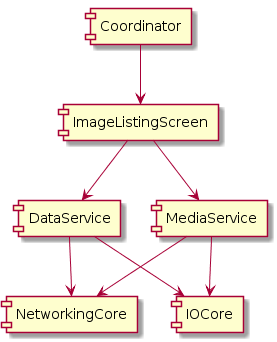

# Flipr Application

Flipr is a image listing application based on [Flickr search API](https://www.flickr.com/services/api/explore/flickr.photos.search).  In this document, high level architecture and application flow will be explained. 

## High Level Architecture
Flipper application is designed by layers with separate responsibilities for the sake of [single responsibility principle](https://en.wikipedia.org/wiki/Single_responsibility_principle). Basically, there are three layers as Core, Service and Presentation. In the source code the modules are not implemented as separate projects however related folders can be threatened as modules.

Each module in the architecture can only have dependency to a module in one layer below and vertical layers for the sake of [substitution principle](https://en.wikipedia.org/wiki/Liskov_substitution_principle). 

### Main Module
Main module consists of an application delegate and a coordinator/router. The coordinator is responsible for providing view controllers and navigate them according to application's navigation flow. Presentation modules, view controllers, would request the coordinator for navigating the application according to specific flow. Thus,  presentation layer should know the coordinator by using delegation pattern as a [dependency inversion principle](https://en.wikipedia.org/wiki/Dependency_inversion_principle).

### Presentation Layer
In the application, there is only one module for listing the images. The module consists of mainly a view controller and a data source. The view controller is responsible for managing two views, search box and collection view. User interactions are handled inside the view controller and passed the user's data to the data source which is responsible for managing the data shown in views.

### Service Layer
There are two services in the services layer, data service and media service. Both services are responsible for providing data models to their consumers so their interfaces are same. The interfaces of modules are defined by using API pattern and defined in a protocol. Thus, any modules dependent to this service would be lightly coupled with the service. 

Services are nothing but a different implementation of a data gathering protocol. Thus, they can be easily changed by any implementation. The current application uses the disk as cache and stores the data gathered into disk. The logic can be different, such as services without caching, services with temporary caching etc. The current services are explained in the titles below.

#### Data Service
Data service provides the metadata of image list. It gets the list of images from Flickr search and returns. This data service supports paging as well. Since the list of images gathered from Flickr is subjected to change, saving the current responses makes some sort of sense. For having a smooth and fast experience for the user, the data service stores only the first page of the results. If user searches for the same keyword again, the service gets the cached response and serves to user, and fetches the updated image list at the same time.

#### Media Service
Media service provides image datas to its consumers. Flickr provides image names in a unique format so it makes sense to store the images with provided names. Unlike data service, media service provides image data if it is already cached. If it is not, it retrieves from internet and serves.

### Core Layer
Core layer modules are designed for generic purposes. They don't have business logic inside and they can be reused in other projects with similar needs. In this project, a  network and IO module are used. They have similar responsibilities like gathering data from related points and storing data if it is applicable. Although. they are similar and they can implement similar protocols, it is better to use different protocols here.

#### Core Networking
The networking module is basically a module for sending `GET` requests and parsing the json and data type responses. The request is a generic model so it can be used for any other purposes.

#### IO Core
The IO module is responsible for reading pure data or dictionary type data from disk and writing them to disk. The consumer of this module can provide and serializable object and write it to disk.

## Application Flow
The application data flow is as follows:
1. User launches the application and provides a search `keyword` in the searchbox
2. View controller gets the keyword and request a new data set from its `data source` with this `keyword`.
3. Data source request the list of objects from `DataService`, creates a new list with the data provided and refreshes the image list in the screen with new data.
4. When a new data is requested from `DataService` with a new `keyword`, 
* `DataService` checks if there is a cached response from `IOCore` with the same `keyword` and provides it if it has. 
* Requests updated data from `NetworkingCore` and gets updated list. After gathering the list, it triggers the same completion block again for refreshing and overrides the cache.
5. `DataSource` provides the cells to the list and while providing it requests the image from `MediaService`
6. Like `DataService`, `MediaService` checks if the image is already cached from `IOCore`, if so it returns the cached data otherwise it tries to gather it from `NetworkingCore` and caches.
7. `DataService` requests the new set of images with the same `keyword` if it started to render the last cell in the results set. Application provides infinite scroll until it gets the last available image.

